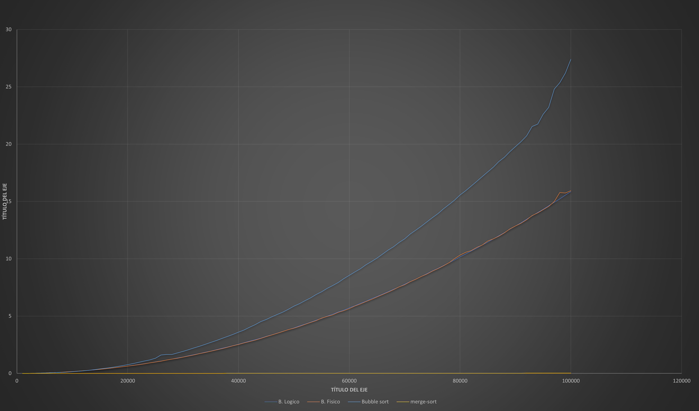
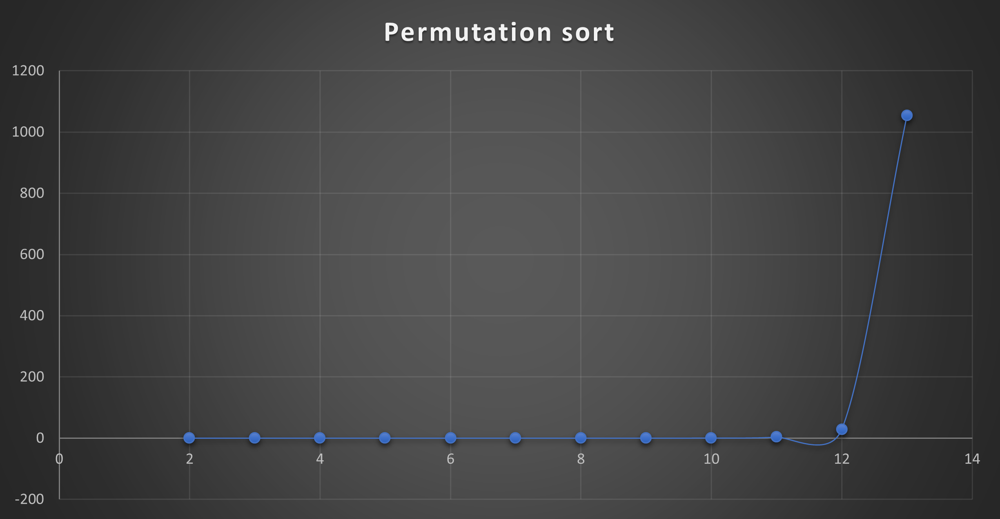

# Algoritmos de Ordenamiento
El objetivo es implementar y analizar diferentes algoritmos de ordenamiento, comparando su comportamiento teórico con los resultados obtenidos experimentalmente.

En esta práctica se estudian algoritmos con diferentes estrategias y complejidades, con el objetivo de observar cómo aumenta el número de operaciones y el tiempo de ejecución conforme crece el tamaño de entrada.

---

## 1. Descripción del problema
El problema consiste en ordenar de menor a mayor un conjunto de números enteros que inicialmente estan desordenados.

Los números se obtienen de un archivo y, a partir de ellos, se forman arreglos de diferentes tamaños. Estos arreglos se utilizan para ejecutar los algoritmos y observar su comportamiento conforme aumenta el número de elementos.

Se implementaron y analizaron los siguientes algoritmos:

- **Ordenamiento por selección in-place: borrado fisico y borrado logico.
- **Bubble Sort.
- **Merge Sort.
- **Permutation Sort.

---

## 2. Algoritmos implementados

### Ordenamiento por selección In-Place
El algoritmo busca el elemento mayor dentro de la parte no ordenada del arreglo.

Una vez localizado, intercambia dicho elemento con la última posición disponible. Después del intercambio, el límite de búsqueda se reduce en una posición y el proceso se repite hasta ordenar completamente el arreglo. Esta implementación trabaja directamente sobre el arreglo original, por lo que no necesita construir un segundo arreglo para almacenar el resultado.

Este ejercicio, también contempla dos variantes de esta estrategia mediante borrado físico y borrado lógico.

<b>Borrado físico</b>
En esta versión, después de encontrar el elemento correspondiente, este se elimina físicamente del arreglo. Los elementos posteriores se desplazan una posición y el tamaño del arreglo disminuye.

**Archivo: "inplace/ordenamiento.c"**

<b>Borrado lógico</b>
En esta versión no se elimina físicamente el elemento. Después de seleccionar el mayor, su posición se marca para indicar que ya fue procesada. 

**Archivo: "inplace/ordenamiento_bl.c"**

### Bubble Sort
Bubble Sort recorre repetidamente el arreglo comparando elementos adyacentes.

Si dos elementos se encuentran en el orden incorrecto, se intercambian. Como resultado de cada recorrido, los elementos mayores se desplazan progresivamente hacia el final del arreglo. Después de cada iteracion se reduce la cantidad de elementos que necesitan ser comparados, ya que la parte final del arreglo se encuentra ordenada.

**Archivo: "bubble_sort/order.c"**

### Merge Sort
Merge Sort utiliza la estrategia **divide y vencerás**.

El arreglo se divide recursivamente en dos partes hasta obtener subarreglos de un solo elemento. Luego, durante el regreso de la recursión, los subarreglos se combinan mediante el proceso de merge.

Durante esta combinación se comparan los elementos de ambos subarreglos y se colocan ordenadamente en el arreglo resultante.

**Archivo: "merge_sort/order.c"**

### Permutation Sort

Permutation Sort genera diferentes permutaciones de los elementos del arreglo hasta encontrar un conjunto que se encuentre ordenado.

Después de generar una permutación, el algoritmo recorre el arreglo para verificar si los elementos están ordenados.

Este procedimiento puede requerir una gran cantidad de intentos conforme aumenta el tamaño de entrada, por ello presenta un crecimiento considerablemente mayor que los otros algoritmos estudiados.

**Archivo: "permutation_sort/order.c"**

---

## 3. Análisis de complejidad

Se analiza la complejidad temporal de cada una de las soluciones implementadas.

| Algoritmo | Complejidad temporal |
|---|:---:|
| Selección In-Place | `O(n^2)` |
| Bubble Sort | `O(n^2)` |
| Merge Sort | `O(n log n)` |
| Permutation Sort | `O(n * n!)` |

#### Selección In-Place

El algoritmo utiliza dos ciclos anidados para ordenar el arreglo. El ciclo externo determina la parte del arreglo que todavía falta por ordenar, mientras que el ciclo interno recorre esa parte para buscar el elemento mayor.

Como se menciono anteriormente, cuando se encuentra el primer elemento mayor, este se intercambia con el elemento que se encuentra al final de la parte no ordenada. Este proceso se repite, reduciendo en cada iteración la cantidad de elementos que faltan por ordenar.

Entonces, en la primera iteración, el ciclo interno realiza aproximadamente n−1 comparaciones; en la siguiente, n−2; después n−3, y así sucesivamente:
El número aproximado de comparaciones es:
```text
(n - 1) + (n - 2) + (n - 3) + ... + 1
```
Esta suma corresponde a:
```text
n(n - 1) / 2
```
En el análisis asintótico se eliminan las constantes y los términos de menor crecimiento, por lo que domina:
```text
O(n^2)
```

#### Bubble Sort

Bubble Sort también utiliza dos ciclos anidados, al igual que el algoritmo anterior. El ciclo interno recorre el arreglo comparando elementos adyacentes y los intercambia cuando se encuentran en el orden incorrecto.

Después de cada iteracion, el elemento mayor de la parte no ordenada queda en su posición final. Por esto, en la siguiente iteración se puede recorrer un elemento menos del arreglo.

El número de comparaciones disminuye progresivamente:
```text
(n - 1) + (n - 2) + ... + 1
```
Por lo tanto, su complejidad temporal es:
```text
O(n^2)
```

#### Merge Sort

Merge Sort divide repetidamente el arreglo aproximadamente a la mitad hasta obtener subarreglos de un solo elemento. Como en cada división el tamaño del problema se reduce a la mitad, se generan aproximadamente:
```text
log₂(n)
```
niveles de recursión.

Al regresar de la recursión, los subarreglos se mezclan de forma ordenada. En cada nivel de recursión, el proceso de mezcla recorre en total los n elementos del arreglo.
Por lo tanto:
```text
n × log<sub>2</sub>(n), $n_i$
```

y su complejidad temporal es:
```text
O(n log n)
```

#### Permutation Sort — `O(n · n!)`
Permutation Sort genera diferentes permutaciones de los elementos del arreglo y comprueba cada una hasta encontrar una que esté ordenada.

Para `n` elementos existen:
```text
n!
```
permutaciones posibles.

Además, comprobar si una permutación está ordenada puede requerir recorrer hasta `n` elementos.
Por lo tanto, el crecimiento considerado para el análisis es:
```text
O(n · n!)
```

Este crecimiento factorial provoca que el algoritmo deje de ser práctico incluso para tamaños de entrada relativamente pequeños.

---

## 4. Metodología experimental

Para estudiar el comportamiento de los algoritmos se utilizaron conjuntos de datos con diferentes tamaños de entrada.

Para cada tamaño se registraron:

- **Tamaño de entrada (`n`).**
- **Número de pasos realizados.**
- **Tiempo de ejecución en segundos.**

En los algoritmos donde se realizaron 30 experimentos para cada tamaño de entrada, se descartaron el tiempo máximo y el tiempo mínimo para reducir el efecto de valores extremos.

El promedio se calculó utilizando las 28 mediciones restantes:

```text
promedio = (suma_tiempos - tiempo_mayor - tiempo_menor) / 28
```

El tiempo de ejecución fue medido en C utilizando:

```c
clock()
```

y convertido a segundos mediante:

```c
tiempo = (double)(fin_tiempo - inicio_tiempo) / CLOCKS_PER_SEC;
```

### Tamaños de entrada

Para los algoritmos capaces de trabajar con entradas grandes se utilizaron tamaños crecientes hasta llegar a:

```text
n = 100000
```

Permutation Sort requiere tamaños considerablemente menores debido a su rápido crecimiento.

---

## 5. Gráficas






---

## 6. Análisis de resultados

**Selección In-Place** y **Bubble Sort** presentan un crecimiento cuadrático **O(n^2)**. Esto se debe a que ambos realizan una gran cantidad de comparaciones sobre los elementos del arreglo. Conforme aumenta **n**, el número de operaciones y el tiempo de ejecución aumentan considerablemente, haciendo que estos algoritmos sean menos eficientes para entradas grandes.

En el caso de **Merge Sort**, su complejidad **O(n log n)** permite un crecimiento menor. La estrategia de dividir el problema en partes más pequeñas y posteriormente combinar los resultados reduce la cantidad de operaciones necesarias en comparación con los algoritmos anteriores, por lo que presenta un mejor comportamiento al trabajar con conjuntos de datos grandes.

Por otro lado, **Permutation Sort** presenta el crecimiento más elevado, con una complejidad **O(n * n!)**. El número de permutaciones aumenta rápidamente conforme crece **n**, provocando que el algoritmo se vuelva impráctico incluso para tamaños de entrada pequeños.

Aunque todos resuelven el mismo problema de ordenamiento, la estrategia utilizada determina la cantidad de operaciones necesarias y, por lo tanto, el tamaño de entrada que pueden procesar de manera práctica.

---

### Tecnologías utilizadas

- **Lenguaje:** C
- **Compilador:** GCC
- **Medición de tiempo:** `clock()`
- **Datos experimentales:** archivos CSV
- **Materia:** Análisis de Algoritmos