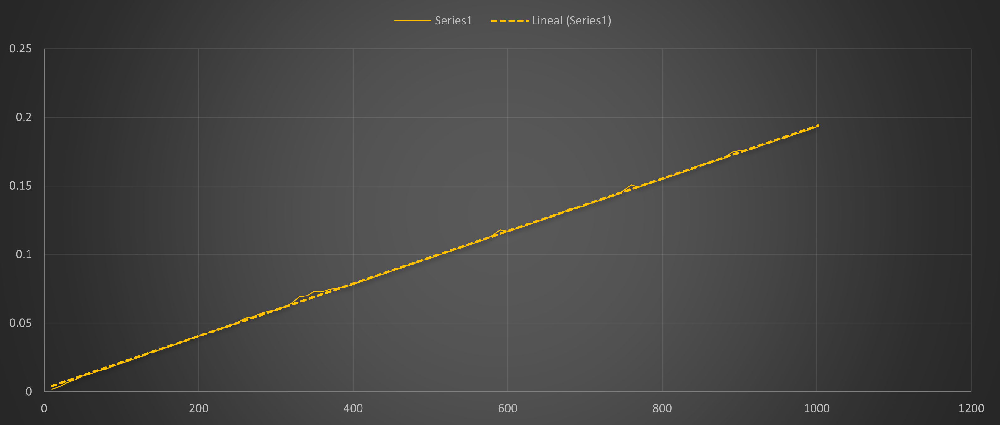

# Busqueda de cadenas de texto
propósito es analizar experimentalmente el comportamiento de un algoritmo de búsqueda de patrones dentro de una cadena de texto.

En esta práctica se utiliza el método de búsqueda ingenua (Naive String Matching) y se analiza cómo cambia el tiempo de ejecución conforme aumenta la longitud del patrón buscado.

---

## 1. Descripción del problema

El problema consiste en determinar las posiciones en las que un patrón aparece dentro de una cadena de texto.

Para realizar los experimentos se utilizan dos archivos:

- **letras_1000.txt: contiene los caracteres utilizados para formar el patrón de búsqueda.**
- **letras_100000.txt: contiene el texto de **100 000 caracteres** sobre el cual se realiza la búsqueda.**

El tamaño del texto permanece constante, mientras que la longitud del patrón aumenta progresivamente.

Los tamaños de patrón utilizados son **m = 10, 20, 30,  hasta n=1000**

El objetivo es observar cómo afecta el incremento del tamaño del patrón al tiempo requerido para realizar la búsqueda.

---

## 2. Algoritmos implementados

### Búsqueda ingenua de patrones

El algoritmo coloca el patrón en cada posición posible del texto y compara sus caracteres uno por uno.

Para cada posición **i** del texto:

1. Se considera inicialmente que el patrón fue encontrado.
2. Se comparan los caracteres del patrón con los caracteres correspondientes del texto.
3. Si alguno de los caracteres es diferente, se marca que el patrón no coincide en esa posición.
4. El proceso continúa con la siguiente posición del texto.

En el programa, este comportamiento se realiza mediante dos ciclos anidados:

```c
for(int i=0; i<=100000-contador; i++){
    bool encontrado = true;

    for(int j=0; j<contador; j++){
        if(cadenaA[j] != cadenaB[i+j]){
            encontrado = false;
        }
    }
}
```

---

## 3. Análisis de complejidad

n = longitud del texto, m = longitud del patrón

Durante la búsqueda, el patrón se compara con diferentes partes del texto. Como el patrón tiene una longitud de **m** caracteres, existen **n − m + 1** posiciones posibles en las que puede iniciar dentro de un texto de longitud **n**.

Para cada una de esas posiciones se comparan m caracteres.
Por lo tanto, el número de comparaciones es aproximadamente **(n - m + 1) * m**

Quitando las constantes, la complejidad temporal puede expresarse como:
```text
O(n * m)
```
---

## 4. Metodología experimental
El texto utilizado para realizar las búsquedas tiene una longitud de **100000 caracteres**
El tamaño del patrón comienza en **10 caracteres** y aumenta de 10 en 10 hasta alcanzar **1000 caracteres**

Para cada tamaño de patrón se realizan **30 ejecuciones**. En cada ejecución se registra el tiempo requerido para recorrer el texto y realizar las comparaciones. Posteriormente se descartan el tiempo máximo y el tiempo mínimo  para reducir el efecto de valores extremos y se calcula un promedio utilizando las **28 ejecuciones restantes**:

```text
promedio = (suma_tiempos - tiempo_mayor - tiempo_menor) / 28
```

El tiempo se mide utilizando clock() y se convierte a segundos mediante:

```c
tiempo = (double)(fin_tiempo - inicio_tiempo) / CLOCKS_PER_SEC;
```
---

## 6. Gráficas

A partir de los resultados experimentales se generaron gráficas para observar el crecimiento de los algoritmos conforme aumenta el tamaño de entrada.



---

## 7. Análisis de resultados

Los resultados muestran un crecimiento aproximadamente lineal del tiempo conforme aumenta la longitud del patron. Esto ocurre porque el texto mantiene un tamaño fijo de **n=100000 caracteres** y **m** aumenta desde 10 hasta 1000.

Cuando aumenta la longitud del patrón, el ciclo interno debe realizar una mayor cantidad de comparaciones para cada posición analizada. Entonces, el número de operaciones está determinado por:

```text
(n - m + 1)  m
```

---

### Tecnologías utilizadas

- **Lenguaje:** C
- **Compilador:** GCC
- **Medición de tiempo:** `clock()`
- **Datos experimentales:** archivos CSV
- **Materia:** Análisis de Algoritmos