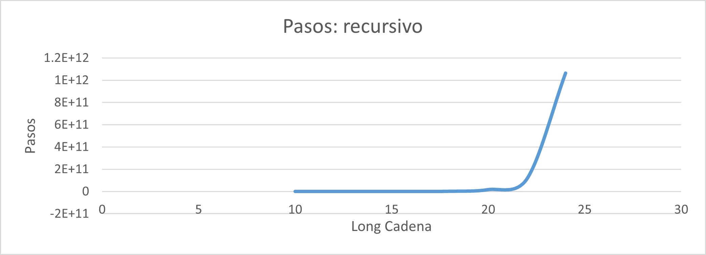
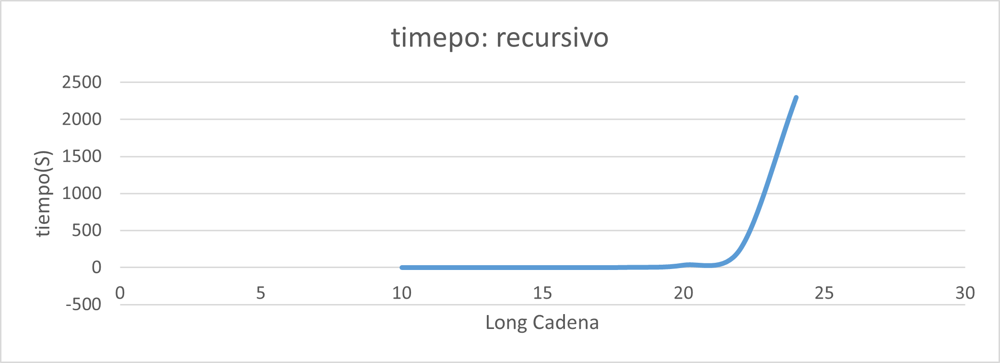
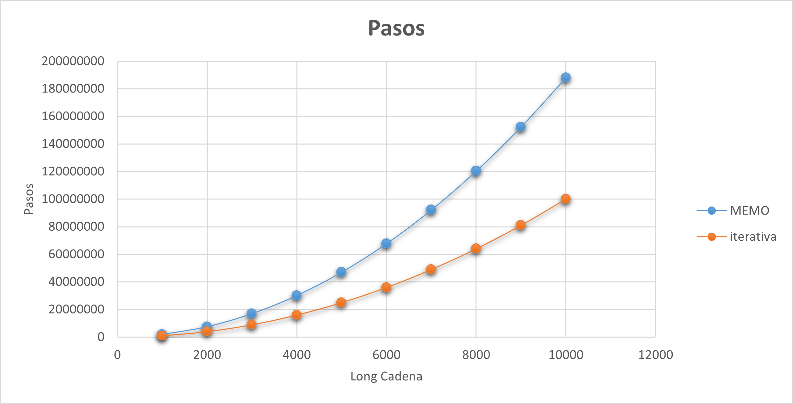
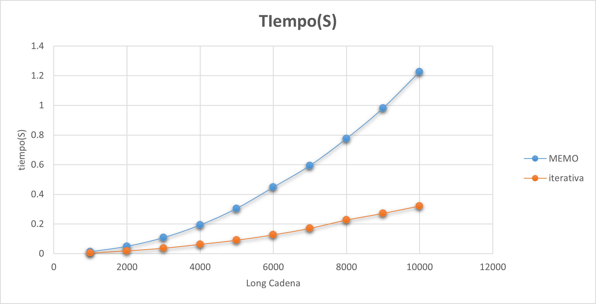

# Longest Common Subsequence (LCSS)

El propósito es analizar el comportamiento de diferentes formas de resolver el problema de la subsecuencia común más larga (LCSS) y observar cómo cambia el número de pasos y el tiempo de ejecución.

En esta práctica se utiliza una versión recursiva, una versión recursiva con memoización y una versión iterativa, con el objetivo de comparar el comportamiento de las tres soluciones.

---

## 1. Descripción del problema

LCSS consiste en encontrar la longitud de la subsecuencia común más larga entre dos cadenas.

Una subsecuencia mantiene el orden de los caracteres de la cadena original, pero no es necesario que los caracteres se encuentren de forma consecutiva.

Por ejemplo, para las cadenas:

```text
A = "ABCDEF"
B = "ACE"
```

Una subsecuencia común es:

```text
ACE
```

con una longitud de `3`.

---

## 2. Algoritmos implementados

Para resolver el problema se implementaron las siguientes versiones:

- LCSS recursivo.
- LCSS recursivo con memoización.
- LCSS iterativo.

El objetivo es observar cómo cambia el número de pasos y el tiempo de ejecución entre las tres versiones conforme aumenta el tamaño de las cadenas.


### LCSS recursivo

**Archivo:** "subsequence.c"

La versión recursiva compara los caracteres actuales de ambas cadenas.

Si los caracteres son iguales, se agrega `1` al resultado y se avanza una posición en ambas cadenas.

Si son diferentes, se consideran dos casos:

```text
Avanzar en la cadena A.
Avanzar en la cadena B.
```

El algoritmo continúa realizando llamadas recursivas y selecciona el resultado mayor entre ambos casos.

El problema de esta implementación es que algunos subproblemas se calculan repetidamente, provocando un rápido crecimiento en el número de llamadas.

### LCSS con memoización

**Archivo:** "subsequeceMemo.c"

La esta versión utiliza recursión con **memoización**.

La memoización consiste en almacenar en una matriz los resultados de los subproblemas que ya fueron calculados.

Antes de realizar nuevamente un cálculo, el algoritmo verifica si el resultado se encuentra almacenado:

```c
if (dp[i][j] != -1)
    return dp[i][j];
```

Si el resultado ya existe, se retorna directamente.

De esta forma se evita repetir los mismos cálculos realizados uno y otra vez.

Este enfoque corresponde a programación dinámica **Top-Down**.

### LCSS iterativo

**Archivo:** "subsequenceiterativa.c"

La tercera versión utiliza programación dinámica de forma iterativa.

Se utiliza una matriz donde cada posición almacena el resultado obtenido para una parte de las dos cadenas.

El algoritmo recorre la matriz mediante dos ciclos anidados:

```c
for (int i = 1; i <= n; i++) {
    for (int j = 1; j <= m; j++) {
```

Si los caracteres coinciden, se utiliza el valor de la posición diagonal anterior más `1`.

Si son diferentes, se selecciona el mayor resultado previamente calculado.

Este enfoque corresponde a programación dinámica **Bottom-Up** o tabulación.

---

## 3. Análisis de complejidad

| Algoritmo | Complejidad temporal |
|---|:---:|
| LCSS recursivo | `O(2^(n+m))` |
| LCSS con memoización | `O(n · m)` |
| LCSS iterativo | `O(n · m)` |

### LCSS recursivo

Cuando los caracteres no coinciden, el algoritmo realiza dos llamadas recursivas.

Estas llamadas pueden generar nuevas llamadas hasta alcanzar el final de alguna de las cadenas.

Además, algunos subproblemas se calculan repetidamente.

Por lo tanto, se considera una complejidad temporal de:

```text
O(2^(n+m))
```

### LCSS con memoización

La versión con memoización almacena los resultados correspondientes a cada combinación de posiciones `(i,j)`.

Como existen hasta `n · m` combinaciones posibles y cada una se calcula una sola vez, la complejidad se reduce a:

```text
O(n · m)
```

### LCSS iterativo

La versión iterativa utiliza dos ciclos anidados.

El primer ciclo recorre los `n` caracteres de una cadena y el segundo los `m` caracteres de la otra.

Por lo tanto, se realizan aproximadamente `n · m` operaciones:

```text
O(n · m)
```

---

## 4. Metodología experimental

Para analizar el comportamiento de las versiones se utilizan diferentes tamaños de cadenas.

Para cada tamaño se registran:

- Número de pasos.
- Tiempo de ejecución.

El tiempo se mide utilizando:

```c
clock()
```

y se convierte a segundos mediante:

```c
tiempo = (double)(tiempo_fin - tiempo_inicio) / CLOCKS_PER_SEC;
```

En la versión recursiva y con memoización se considera como un **paso** cada vez que se realiza una llamada a la función `LCSS()`.

El contador se incrementa mediante:

```c
pasos++;
```

En la versión iterativa se considera como un **paso** cada iteración realizada por los dos ciclos que recorren la matriz.

De esta forma, los resultados permiten comparar el crecimiento de las diferentes versiones.

---

## 5. Graficas

A partir de los resultados experimentales se generan gráficas para observar el crecimiento de los algoritmos conforme aumenta el tamaño de las cadenas.

### LCSS recursivo: Conteo de Pasos



### LCSS recursivo: Conteo de Tiempos




### LCSS con memoización y iterativo: Conteo de Pasos



### LCSS con memoización y iterativo: Conteo de Tiempos



---

## 6. Análisis de resultados

En la versión recursiva, el número de llamadas aumenta rápidamente conforme aumenta el tamaño de las cadenas, debido a que algunos subproblemas se calculan varias veces.

Este comportamiento produce un crecimiento exponencial, consistente con:

```text
O(2^(n+m))
```

En la versión con memoización, los resultados calculados se almacenan y se reutilizan cuando son necesarios nuevamente.

Esto evita repetir cálculos y reduce el crecimiento a:

```text
O(n · m)
```

La versión iterativa también presenta una complejidad:

```text
O(n · m)
```

debido a que utiliza dos ciclos anidados para recorrer las combinaciones de posiciones de ambas cadenas.

Las gráficas permiten observar la diferencia entre resolver LCSS mediante recursión simple y utilizar programación dinámica mediante memoización o tabulación.

---

## 7. Conclusiones

La versión recursiva de LCSS permite resolver el problema utilizando llamadas recursivas. Sin embargo, algunos subproblemas se calculan repetidamente, provocando que el número de operaciones aumente rápidamente conforme aumenta el tamaño de las cadenas.

La versión con memoización mantiene el enfoque recursivo, pero almacena los resultados calculados para evitar repetir los mismos subproblemas.

La versión iterativa utiliza una matriz para construir los resultados desde los casos más pequeños hasta obtener la solución final.

De esta forma, las versiones con programación dinámica reducen la complejidad temporal de un crecimiento exponencial a:

```text
O(n · m)
```

La comparación permite observar que la memoización e iterativa mejoran el comportamiento del algoritmo al evitar el cálculo repetido de los mismos subproblemas.

---

### Tecnologías utilizadas

- **Lenguaje:** C
- **Compilador:** GCC
- **Medición de tiempo:** `clock()`
- **Materia:** Análisis de Algoritmos