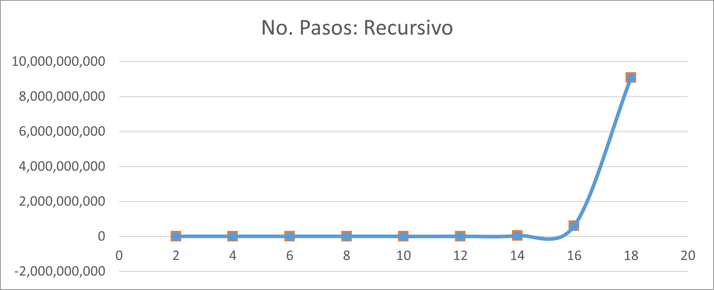
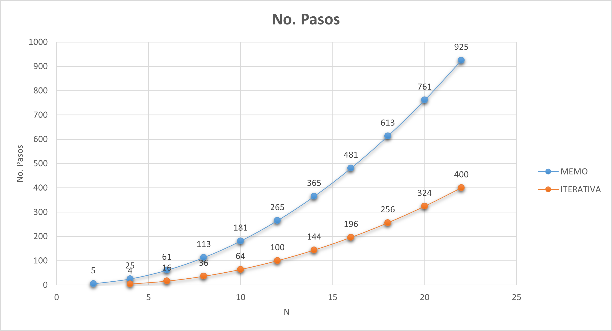
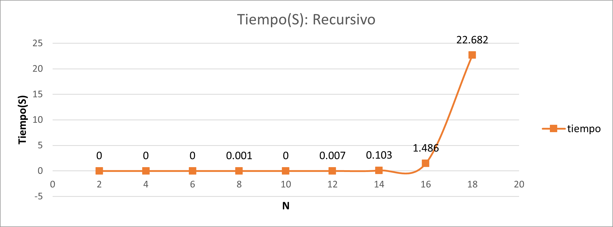
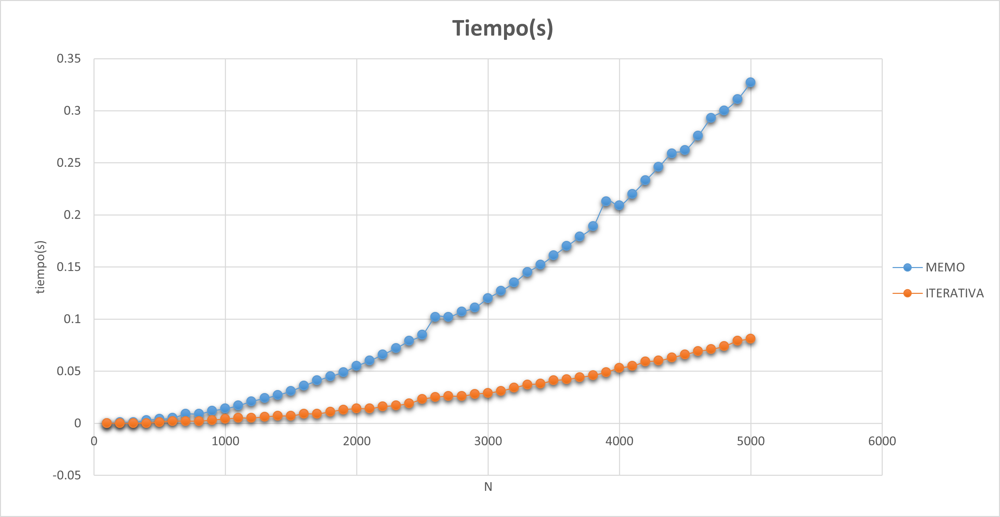

# Laberinto del Tesoro

El propósito es analizar el comportamiento de diferentes formas de resolver el problema del Laberinto del Tesoro y observar cómo cambia el número de pasos y el tiempo de ejecución.

En esta práctica se utiliza una versión recursiva, una versión recursiva con memoización y una versión iterativa, con el objetivo de comparar el comportamiento de las tres soluciones.

---

## 1. Descripción del problema

El problema del Laberinto del Tesoro consiste en encontrar el camino que permita acumular la mayor cantidad de tesoro dentro de una matriz.

Cada posición de la matriz contiene una cantidad de tesoro y para llegar a una posición se consideran los caminos que provienen desde arriba o desde la izquierda.

Para cada posición se selecciona el camino que permita acumular la mayor cantidad de tesoro.

El problema consiste en obtener el máximo tesoro acumulado desde la posición inicial:

```text
(0,0)
```

hasta la posición final:

```text
(n-1,n-1)
```

Se implementaron las siguientes versiones:

- Laberinto del Tesoro recursivo.
- Laberinto del Tesoro con memoización.
- Laberinto del Tesoro iterativo.

El objetivo es observar cómo cambia el número de pasos y el tiempo de ejecución entre las tres versiones conforme aumenta el tamaño de la matriz.

---

## 2. Algoritmos implementados

### Laberinto del Tesoro recursivo

**Archivo:** "laberintotesoro_.c"

La versión recursiva inicia desde la posición final de la matriz y realiza llamadas recursivas considerando dos posibles caminos:

```text
Arriba
Izquierda
```

Para cada posición se calculan ambos caminos y se selecciona el que permita acumular la mayor cantidad de tesoro.

```c
int arriba = LT_rec(i - 1, j);
int izquierda = LT_rec(i, j - 1);
```

Este proceso continúa hasta alcanzar la posición inicial `(0,0)`.

El problema de esta implementación es que algunos caminos y posiciones se calculan repetidamente, provocando que el número de llamadas aumente rápidamente conforme aumenta el tamaño de la matriz.

### Laberinto del Tesoro con memoización

**Archivo:** "laberintomemo.c"

La segunda versión utiliza recursión con **memoización**.

La memoización consiste en almacenar en una matriz los resultados que ya fueron calculados.

Antes de calcular nuevamente una posición, el algoritmo verifica si el resultado se encuentra almacenado:

```c
if (dp[i][j] != -1)
    return dp[i][j];
```

Si el resultado ya existe, se retorna directamente y no se vuelve a realizar el mismo cálculo.

De esta forma se evita repetir los mismos cálculos realizados por la versión recursiva.

Este enfoque corresponde a programación dinámica **Top-Down**.

### Laberinto del Tesoro iterativo

**Archivo:** "laberintoiterativa.c"

La tercera versión utiliza programación dinámica de forma iterativa.

Se utiliza una matriz, donde cada posición almacena la cantidad máxima de tesoro que puede acumularse hasta esa posición.

El algoritmo recorre la matriz utilizando dos ciclos anidados.

Para cada posición se obtiene el valor acumulado desde arriba y desde la izquierda:

```c
int arriba = dp[i - 1][j];
int izquierda = dp[i][j - 1];
```

Posteriormente se selecciona el mayor y se suma el tesoro de la posición actual.

Este enfoque corresponde a programación dinámica **Bottom-Up** o tabulación.

---

## 3. Análisis de complejidad

| Algoritmo | Complejidad temporal |
|---|:---:|
| Laberinto recursivo | `O(2^(n+n))` |
| Laberinto con memoización | `O(n²)` |
| Laberinto iterativo | `O(n²)` |

### Laberinto del Tesoro recursivo

Para una posición de la matriz, el algoritmo puede realizar dos llamadas recursivas:

```text
Arriba
Izquierda
```

Cada una de estas llamadas puede generar nuevas llamadas hasta alcanzar los límites de la matriz.

Además, algunas posiciones se calculan repetidamente.

Por lo tanto, para una matriz de `n × n`, se considera una complejidad temporal de:

```text
O(2^(n+n))
```

Este crecimiento provoca que la versión recursiva deje de ser práctica para matrices grandes.

### Laberinto del Tesoro con memoización

La versión con memoización almacena el resultado correspondiente a cada posición `(i,j)`.

En una matriz de tamaño:

```text
n × n
```

existen `n²` posiciones posibles.

Cada posición se calcula y se almacena para evitar volver a realizar el mismo cálculo.

Por esta razón, el crecimiento se reduce a:

```text
O(n²)
```

### Laberinto del Tesoro iterativo

La versión iterativa utiliza dos ciclos anidados para recorrer la matriz:

```c
for (int i = 0; i < n; i++) {
    for (int j = 0; j < n; j++) {
```

Ambos ciclos recorren hasta `n`.

Por lo tanto, se recorren las `n²` posiciones de la matriz y la complejidad temporal es:

```text
O(n²)
```

---


## 4. Metodología experimental

Para analizar el comportamiento de las tres versiones se utilizan diferentes tamaños de matrices.

Los valores de la matriz se generan de forma aleatoria utilizando valores entre `1` y `20`.

Se utiliza una semilla fija:

```c
srand(1);
```

para mantener los mismos valores durante los experimentos.

Para cada tamaño de matriz se registran:

- Máximo tesoro acumulado.
- Número de pasos o llamadas.
- Tiempo de ejecución.

El tiempo se mide utilizando:

```c
clock()
```

y se convierte a segundos mediante:

```c
tiempo = (double)(tiempo_fin - tiempo_inicio) / CLOCKS_PER_SEC;
```

En la versión recursiva y con memoización se considera como un **paso** cada vez que se realiza una llamada a la función correspondiente.

En la versión iterativa se considera como un **paso** cada posición de la matriz procesada por los ciclos.

De esta forma, los resultados permiten observar el crecimiento de cada versión conforme aumenta el tamaño de la matriz.

---

## 5. Graficas

A partir de los resultados experimentales se generan gráficas para observar el crecimiento de los algoritmos conforme aumenta el tamaño de la matriz.

### Laberinto recursivo: Conteo de Pasos



### Laberinto con memoización e iterativo: Conteo de Pasos



### Laberinto recursivo: Conteo de Tiempos



### Laberinto con memoización e iterativo: Conteo de Tiempos



---

## 6. Análisis de resultados

En la versión recursiva, el número de llamadas aumenta rápidamente conforme aumenta el tamaño de las cadenas, debido a que algunos subproblemas se calculan varias veces.

Este comportamiento produce un crecimiento exponencial, consistente con:

```text
O(2^(n+m))
```

En la versión con memoización, los resultados calculados se almacenan y se reutilizan cuando son necesarios nuevamente.

Esto evita repetir cálculos y reduce el crecimiento a:

```text
O(n · m)
```

La versión iterativa también presenta una complejidad:

```text
O(n · m)
```

debido a que utiliza dos ciclos anidados para recorrer las combinaciones de posiciones de ambas cadenas.

Las gráficas permiten observar la diferencia entre resolver LCSS mediante recursión simple y utilizar programación dinámica mediante memoización o tabulación.

---

## 7. Conclusiones

La versión recursiva de LCSS permite resolver el problema utilizando llamadas recursivas. Sin embargo, algunos subproblemas se calculan repetidamente, provocando que el número de operaciones aumente rápidamente conforme aumenta el tamaño de las cadenas.

La versión con memoización mantiene el enfoque recursivo, pero almacena los resultados calculados para evitar repetir los mismos subproblemas.

La versión iterativa utiliza una matriz para construir los resultados desde los casos más pequeños hasta obtener la solución final.

De esta forma, las versiones con programación dinámica reducen la complejidad temporal de un crecimiento exponencial a:

```text
O(n · m)
```

La comparación permite observar que la memoización e iterativa mejoran el comportamiento del algoritmo al evitar el cálculo repetido de los mismos subproblemas.

---

### Tecnologías utilizadas

- **Lenguaje:** C
- **Compilador:** GCC
- **Medición de tiempo:** `clock()`
- **Materia:** Análisis de Algoritmos