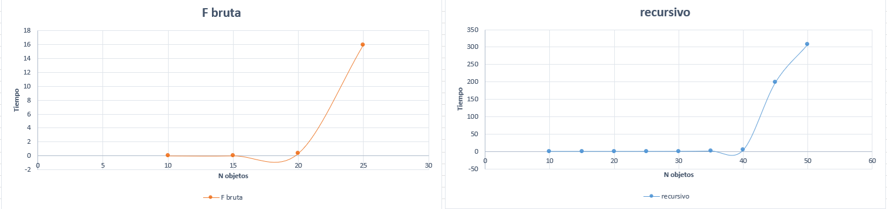
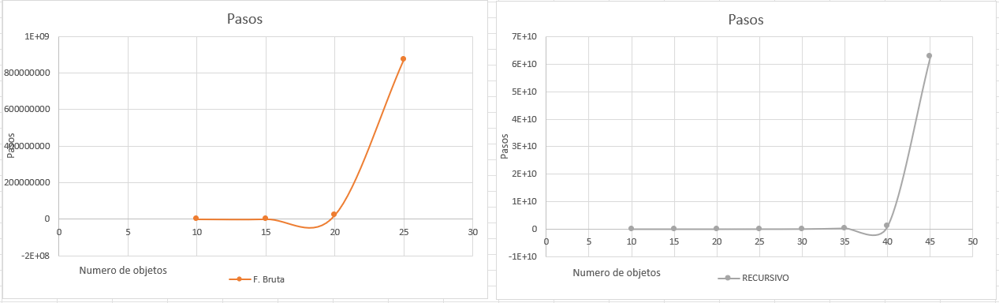
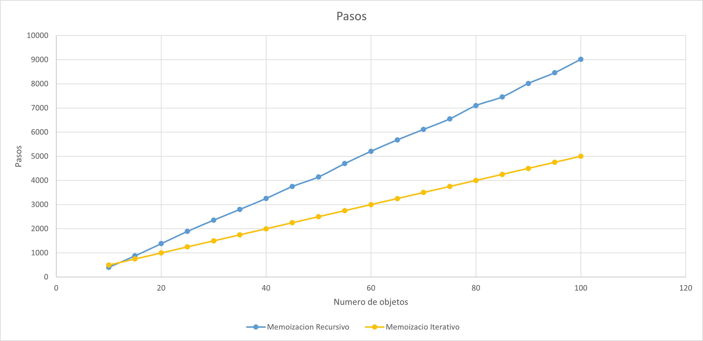

# Knapsack Problem

El **Knapsack Problem (problema de la mochila)** consiste en seleccionar un conjunto de objetos, donde cada objeto tiene un **peso** y un **valor**, buscando obtener el mayor valor posible sin superar la capacidad máxima de la mochila.

En este experimento se implementaron diferentes enfoques para resolver el mismo problema y comparar su comportamiento:

- Recursivo.
- Fuerza bruta iterativa.
- Recursivo con memoización.
- Iterativo con programación dinámica.

Cada objeto se representa mediante la estructura:

```c
typedef struct{
    char objeto;
    int valor;
    int peso;
}Tobjeto;
```

---

## 2. Algoritmos implementados  

### Enfoque recursivo

La versión recursiva analiza dos posibilidades para cada objeto:

1. **Agregar el objeto**, si su peso no supera la capacidad disponible.
2. **Ignorar el objeto** y continuar con el siguiente.

```c
if(objetos[i].peso <= capacidadBolsa){
    valorAgregado = objetos[i].valor +
        maximizar(objetos, longitud, i+1,
        capacidadBolsa-objetos[i].peso);
}

int valorIngnorado =
    maximizar(objetos, longitud, i+1, capacidadBolsa);
```

Finalmente se selecciona el mayor valor entre ambas posibilidades.

Al no almacenar resultados previamente calculados, se vuelven a resolver subproblemas, provocando un crecimiento exponencial.


### Enfoque de fuerza bruta iterativo

Esta versión genera y analiza todas las combinaciones posibles de objetos.

Para `n` objetos existen `2^n` combinaciones, ya que cada objeto puede estar incluido o no incluido en la mochila.


Por ejemplo, con 3 objetos `A`, `B`, `C` existen `2^3=8` combinaciones:

`{ }, {A}, {B}, {C}, {A,B}, {A,C}, {B,C}, {A,B,C}`

El algoritmo recorre cada combinación y calcula su peso y valor total. Si el peso no supera la capacidad de la mochila, compara su valor con el mejor encontrado hasta ese momento.


### Enfoque recursivo con memoización

Esta versión mantiene el funcionamiento recursivo, pero utiliza una matriz de memoización para almacenar los resultados ya calculados.

Cada estado depende de:

- El objeto actual `i`.
- La capacidad disponible de la mochila.

Antes de realizar nuevamente un cálculo, se verifica si el resultado ya se encuentra almacenado:

```c
if(memo[i][capacidadBolsa] != -1){
    return memo[i][capacidadBolsa];
}
```

Cuando se obtiene el mejor resultado, este se guarda en la matriz para poder reutilizarlo posteriormente.

La matriz se inicializa con `-1`, indicando que los estados todavía no han sido calculados.

De esta forma se evita repetir los mismos cálculos realizados una y otra vez.


### Enfoque iterativo con programación dinámica

La versión iterativa utiliza una tabla de programación dinámica de tamaño:

```text
(n + 1) × (W + 1)
```

La tabla se inicializa en `0` y se construye desde los problemas más pequeños hasta obtener la solución completa.

Para cada objeto y cada capacidad se comparan dos posibilidades:

```c
int valorAgregado = valorActual +
    tabla[i - 1][c - pesoActual];

int valorIgnorado =
    tabla[i - 1][c];
```

Se almacena en la posición actual el mayor de estos valores. Al terminar, `tabla[longitud][capacidadBolsa]` contiene el mejor valor que puede obtenerse sin superar la capacidad de la mochila.

Este enfoque corresponde a programación dinámica **bottom-up**, ya que inicia con los casos más pequeños y construye progresivamente la solución.

---

## 3. Análisis de complejidad

| Enfoque | Técnica | Complejidad temporal |
|---|---|---|
| Recursivo | Recursión | `O(2^n)` |
| Fuerza bruta | Iterativo / combinaciones | `O(n · 2^n)` |
| Recursivo con memoización | Programación dinámica Top-Down | `O(n · W)` |
| Iterativo | Programación dinámica Bottom-Up | `O(n · W)` |

Los enfoques recursivo y de fuerza bruta presentan un crecimiento exponencial debido a la cantidad de posibilidades que deben analizar.

En cambio, las versiones con programación dinámica aprovechan los resultados de subproblemas ya resueltos. La versión con memoización lo hace mediante un enfoque **Top-Down**, mientras que la versión iterativa construye la solución mediante **Bottom-Up**.

---

### 4. Metodología experimental

Para realizar las pruebas se generan objetos con:

```text
Valor: 1 a 20
Peso:  1 a 10
Capacidad de la mochila: 50
```

Los programas registran el número de pasos realizados y el tiempo de ejecución mediante `clock()`. Por cada tamaño de entrada se imprime:

```text
n, mejor valor, pasos, tiempo
```

Por ejemplo:

```text
10, valor, pasos, tiempo
15, valor, pasos, tiempo
20, valor, pasos, tiempo
...
```

En las implementaciones se utiliza `srand(1)`, permitiendo trabajar con una secuencia reproducible de valores generados por `rand()`.

---

## 5. Graficas

### Fuerza bruta y Recursivo: Conteo de tiempos



### Fuerza bruta y Recursivo: Conteo de pasos



### Memoizacion recursivo y Memoizacion iterativo: Conteo de pasos




