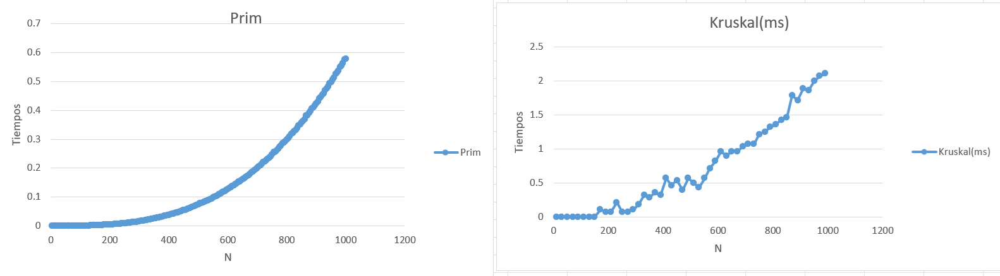

# Árbol de Expansión Mínima

## 1. Descripción

El **Árbol de Expansión Mínima (AEM)** consiste en encontrar un conjunto de aristas que permita conectar todos los vértices de un grafo, sin formar ciclos y buscando que la suma de los pesos de las aristas seleccionadas sea la menor posible.

En este experimento se implementaron dos algoritmos para obtener un árbol de expansión mínima:

- **Prim**.
- **Kruskal**.

Ambos algoritmos siguen un enfoque voraz (**greedy**), ya que en cada paso toman una decisión buscando seleccionar una arista de menor peso, pero utilizan diferentes procedimientos para construir el árbol.

---

## 2. Algoritmos implementados

### Prim

El algoritmo de **Prim** construye el árbol de expansión mínima comenzando desde un vértice inicial y agregando progresivamente nuevos vértices mediante las aristas de menor peso.

La implementación utiliza una matriz de adyacencia para representar el grafo y tres arreglos principales:

- `cola`: contiene los vértices pendientes de agregar.
- `key`: almacena el menor peso conocido para conectar cada vértice.
- `pi`: almacena el vértice padre de cada nodo dentro del árbol.

Para seleccionar el siguiente vértice se utiliza una cola de prioridad basada en un **min-heap**.

Después de extraer un vértice, se recorren sus adyacentes y se actualizan los valores de `key` cuando se encuentra una conexión con menor peso.

---

### Kruskal

El algoritmo de **Kruskal** trabaja directamente con las aristas del grafo.

Inicialmente, las aristas de la matriz de adyacencia se almacenan en un arreglo con la forma:

```text
[origen, destino, peso]
```

Posteriormente, las aristas se ordenan de menor a mayor peso.

El algoritmo recorre las aristas ordenadas y agrega una arista cuando los vértices que conecta pertenecen a conjuntos diferentes. De esta forma se evita la formación de ciclos.

Cuando una arista es seleccionada, los conjuntos correspondientes a sus vértices son unidos. El proceso continúa hasta obtener `n - 1` aristas.

---

## 3. Análisis de complejidad

### Prim

En la implementación utilizada, el grafo se representa mediante una **matriz de adyacencia**.

Para cada vértice extraído se recorren los posibles vértices adyacentes. Además, la función utilizada para determinar si un vértice continúa dentro de la cola realiza otro recorrido sobre los elementos pendientes.

Por esta razón, para esta implementación el crecimiento puede aproximarse como:

```text
O(V^3)
```

donde `V` representa el número de vértices.

Aunque se utiliza un min-heap para seleccionar los elementos de menor peso, el recorrido realizado para comprobar los elementos que permanecen en la cola incrementa el trabajo realizado por el algoritmo.

---

### Kruskal

Kruskal requiere inicialmente obtener las aristas del grafo y ordenarlas de acuerdo con su peso.

El ordenamiento de `n` aristas tiene una complejidad aproximada de:

```text
O(n log n)
```

Posteriormente, las aristas son recorridas para determinar cuáles pueden agregarse al árbol sin generar ciclos.

En la implementación utilizada, la operación `union_set` recorre el arreglo de vértices para realizar la unión de los conjuntos, por lo que esta operación tiene un costo de:

```text
O(n)
```

Considerando el ordenamiento de las aristas, la operación principal que caracteriza a Kruskal es:

```text
O(n log n)
```

---

## 4. Metodología experimental

Para analizar el comportamiento de los algoritmos se utilizó un grafo representado mediante una **matriz de adyacencia**, cuyos datos fueron obtenidos desde el archivo:

```text
coordenadas.csv
```

Se utilizaron diferentes tamaños de entrada, aumentando progresivamente el número de vértices hasta aproximadamente `n = 1000`.

Para cada tamaño de entrada se realizaron:

```text
30 experimentos
```

En cada grupo de experimentos se registró el tiempo de ejecución. Para reducir el efecto de valores extremos, se eliminó el tiempo mayor y el tiempo menor registrados.

El promedio se obtuvo utilizando los 28 valores restantes:

```text
promedio = (suma - (mayor + menor)) / 28
```

En **Prim**, los tamaños utilizados van desde `n = 20` hasta `n = 1000`, con incrementos de 5.

En **Kruskal**, los tamaños utilizados van desde `n = 10` hasta valores cercanos a `n = 1000`, con incrementos de 20.

Los tiempos de Prim fueron registrados en **segundos**, mientras que los tiempos mostrados para Kruskal fueron registrados en **milisegundos**.

---

## 5. Gráficas

### Prim y Kruskal



---