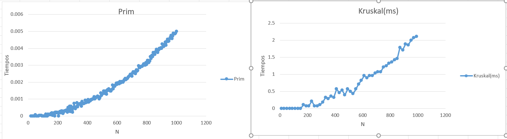

# Árbol de Expansión Mínima

## 1. Descripción

El **Árbol de Expansión Mínima (AEM)** consiste en encontrar un conjunto de aristas que permita conectar todos los vértices de un grafo, sin formar ciclos y buscando que la suma de los pesos de las aristas seleccionadas sea la menor posible.

En este experimento se implementaron dos algoritmos para obtener un árbol de expansión mínima:

- **Prim**.
- **Kruskal**.

Ambos algoritmos siguen un enfoque voraz (**greedy**), ya que en cada paso toman una decisión buscando seleccionar una arista de menor peso, pero utilizan diferentes procedimientos para construir el árbol.

---

## 2. Algoritmos implementados

### Prim

El algoritmo de **Prim** construye el árbol de expansión mínima comenzando desde un vértice inicial y agregando progresivamente nuevos vértices mediante las aristas de menor peso.

La implementación utiliza una matriz de adyacencia para representar el grafo y tres arreglos principales:

- `cola`: contiene los vértices pendientes de agregar.
- `key`: almacena el menor peso conocido para conectar cada vértice.
- `pi`: almacena el vértice padre de cada nodo dentro del árbol.
- `posicionEnHeap`: almacena la posición actual de cada vértice dentro del heap.

El arreglo posicionEnHeap permite saber directamente si un vértice continúa dentro de la cola de prioridad. Cuando un vértice es extraído del heap, su posición se establece en -1.

Cuando se encuentra una arista con menor peso para conectar un vértice, se actualizan key y pi, y posteriormente se utiliza la función disminuir_clave para reorganizar el vértice dentro del min-heap.

De esta forma, el algoritmo siempre puede extraer el vértice con menor valor de key y mantener la estructura de la cola de prioridad.

---

### Kruskal

El algoritmo de **Kruskal** trabaja directamente con las aristas del grafo.

Inicialmente, las aristas de la matriz de adyacencia se almacenan en un arreglo con la forma:

```text
[origen, destino, peso]
```

Posteriormente, las aristas se ordenan de menor a mayor peso.

El algoritmo recorre las aristas ordenadas y agrega una arista cuando los vértices que conecta pertenecen a conjuntos diferentes. De esta forma se evita la formación de ciclos.

Cuando una arista es seleccionada, los conjuntos correspondientes a sus vértices son unidos. El proceso continúa hasta obtener `n - 1` aristas.

---

## 3. Análisis de complejidad

### Prim

La implementación utiliza una **matriz de adyacencia**, por lo que se recorren hasta `V^2` posiciones para buscar las conexiones entre los vértices.

La consulta para saber si un vértice continúa en el heap tiene una complejidad de `O(1)`, mientras que las operaciones `disminuir_clave` y `min_heapify` tienen una complejidad de `O(log V)`.

Por lo tanto, considerando el recorrido de la matriz y las posibles actualizaciones del min-heap, la complejidad de esta implementación en el peor caso es:

**O(V² log V)**

---

### Kruskal

Kruskal obtiene las aristas del grafo y las ordena de menor a mayor peso. El ordenamiento de `E` aristas tiene una complejidad de `O(E log E)`.

Después, las aristas son recorridas para seleccionar aquellas que no generen ciclos. En esta implementación, `union_set` recorre el arreglo de vértices, por lo que tiene un costo de `O(V)`.

Por lo tanto, la complejidad está dominada principalmente por el ordenamiento de las aristas y por las operaciones de unión realizadas durante el algoritmo.

---

## 4. Metodología experimental

Para analizar el comportamiento de los algoritmos **Prim** y **Kruskal**, se utilizó un grafo representado mediante una matriz de adyacencia obtenida del archivo `coordenadas.csv`.

En **Prim**, se utilizaron tamaños de entrada desde `n = 20` hasta `n = 1000`, aumentando en intervalos de 5 vértices. Para cada tamaño se realizaron **30 ejecuciones** del algoritmo.

En **Kruskal**, se utilizaron tamaños desde `n = 10` hasta valores cercanos a `n = 1000`, aumentando en intervalos de 20 vértices. Para cada tamaño también se realizaron **30 ejecuciones**.

En ambos casos se registró el tiempo de ejecución y, para reducir el efecto de valores extremos, se eliminó el tiempo mayor y el menor. El promedio se calculó utilizando las **28 mediciones restantes**.

En Prim, los tiempos fueron registrados en **segundos**, mientras que en Kruskal se registraron en **milisegundos**. 

---

## 5. Gráficas

### Prim y Kruskal



---

## 6. Análisis de los resultados

En **Prim**, los tiempos se mantienen bajos para entradas pequeñas y aumentan de forma progresiva conforme crece `N`. Para valores cercanos a `n = 1000`, el tiempo alcanza aproximadamente **0.005 segundos**. La gráfica presenta un crecimiento continuo, relacionado con el recorrido de la matriz de adyacencia y las operaciones realizadas sobre el min-heap.

En **Kruskal**, los tiempos también aumentan conforme crece `N`, aunque se presentan mayores variaciones entre algunos tamaños de entrada. Para valores cercanos a `n = 1000`, el tiempo registrado alcanza aproximadamente **2.1 milisegundos**.

En general, los resultados experimentales muestran el crecimiento esperado de ambos algoritmos: para entradas pequeñas los tiempos son reducidos, mientras que al aumentar el número de vértices también aumenta el trabajo necesario para construir el árbol de expansión mínima.

### Tecnologías utilizadas

- **Lenguaje:** C
- **Compilador:** GCC
- **Medición de tiempo:** `clock()`
- **Materia:** Análisis de Algoritmos