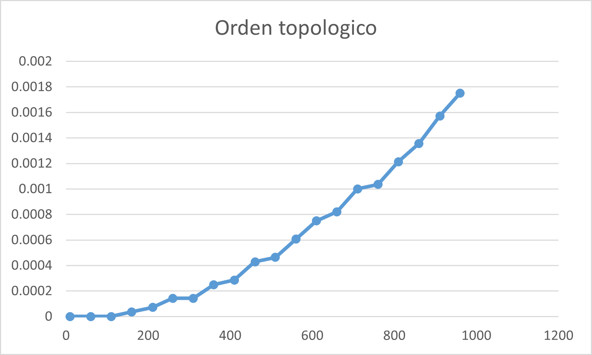

# Orden Topológico

## 1. Descripción

El **orden topológico** consiste en obtener un orden lineal de los vértices de un grafo dirigido, de manera que los vértices se organicen de acuerdo con las relaciones existentes entre ellos.

En este experimento se implementó el orden topológico utilizando **búsqueda en profundidad (DFS)** sobre un grafo representado mediante una matriz de adyacencia.

El algoritmo realiza el recorrido en profundidad y, cuando termina de explorar completamente un vértice, lo agrega al inicio de una lista. De esta forma, los vértices quedan ordenados de acuerdo con sus tiempos de finalización.

---

## 2. Algoritmos implementados

### Búsqueda en profundidad

El algoritmo utiliza **DFS** para recorrer los vértices del grafo.

Para controlar el estado de cada vértice se utilizan tres colores:

- **Blanco:** el vértice todavía no ha sido visitado.
- **Gris:** el vértice fue descubierto y está siendo explorado.
- **Negro:** el vértice ya fue completamente explorado.

Durante el recorrido se almacenan los tiempos de descubrimiento y finalización de cada vértice mediante los arreglos **d** y **f**.

Cuando DFS encuentra un vértice adyacente que todavía se encuentra en blanco, continúa el recorrido de manera recursiva desde ese vértice.

### Orden topológico

El orden topológico se obtiene a partir del recorrido DFS.

Cuando un vértice termina de ser explorado y cambia a color negro, se agrega al inicio de una lista ligada mediante la función **agregarAlInicio**.

De esta forma, los vértices que terminan después durante el recorrido quedan colocados antes en la lista, generando el orden topológico.

---

## 3. Análisis de complejidad

La implementación utiliza una **matriz de adyacencia**. Para cada vértice visitado, DFS recorre una fila completa de la matriz para buscar sus vértices adyacentes.

Como existen **n vértices** y para cada uno pueden revisarse **n posiciones**, el recorrido tiene una complejidad de:

**O(n^2)**

Agregar un vértice al inicio de la lista tiene un costo de **O(1)** y esta operación se realiza una vez por cada vértice.

Por lo tanto, el recorrido de la matriz de adyacencia representa el costo principal y la complejidad de esta implementación es:

**O(n^2)**

---

## 4. Metodología experimental

Para analizar el comportamiento del algoritmo se utilizó un **grafo dirigido** representado mediante una matriz de adyacencia obtenida del archivo **g_dirigido.csv**.

Se utilizaron diferentes tamaños de entrada, aumentando progresivamente el número de vértices hasta aproximadamente **n = 1000**.

Para cada tamaño de entrada se realizaron **30 ejecuciones** del algoritmo.

En cada ejecución se registró el tiempo utilizado por DFS para recorrer el grafo y construir la lista correspondiente al orden topológico.

Para reducir el efecto de valores extremos, se eliminó el tiempo mayor y el tiempo menor de las 30 ejecuciones. Posteriormente, se calculó el promedio utilizando las **28 mediciones restantes**.

Los tiempos fueron registrados en **segundos** utilizando la función **clock()**.

---

## 5. Graficas

### Orden topológico

La gráfica muestra el comportamiento del tiempo de ejecución conforme aumenta el número de vértices del grafo.

---

## 6. Análisis de los resultados

Los resultados muestran que el tiempo de ejecución del **orden topológico** aumenta conforme crece el número de vértices del grafo.

Para tamaños pequeños, el tiempo de ejecución se mantiene bajo. Conforme aumenta el valor de **N**, también aumenta el número de posiciones de la matriz de adyacencia que deben ser revisadas durante el recorrido DFS.

Este comportamiento se relaciona con la complejidad **O(n^2)** de la implementación, debido a que para cada vértice se recorre una fila de la matriz de adyacencia.

En general, los resultados permiten observar que el tiempo aumenta conforme aumenta el tamaño del grafo, comportamiento esperado para la implementación utilizada.

### Tecnologías utilizadas

- **Lenguaje:** C
- **Compilador:** GCC
- **Medición de tiempo:** **clock()**
- **Materia:** Análisis de Algoritmos