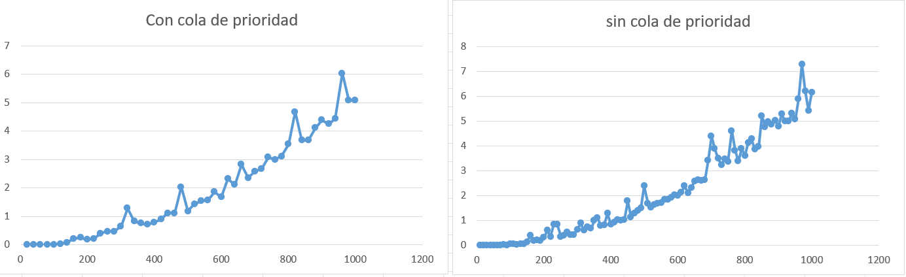

# Dijkstra

## 1. Descripción

El algoritmo de **Dijkstra** permite encontrar las distancias mínimas desde un vértice inicial hacia los demás vértices de un grafo con pesos.

En este trabajo se implementaron dos enfoques para resolver el mismo problema:

- **Dijkstra con arreglo de distancias**.
- **Dijkstra con cola de prioridad**.

Ambas implementaciones utilizan una **matriz de adyacencia** para representar el grafo y comienzan desde el vértice 0. La diferencia principal se encuentra en la forma de seleccionar el siguiente vértice con menor distancia.

---

## 2. Algoritmos implementados

### Dijkstra con arreglo de distancias

Esta implementación utiliza tres arreglos principales:

- **dist**: almacena la menor distancia conocida desde el vértice inicial hasta cada vértice.
- **parent**: almacena el padre de cada vértice dentro del camino encontrado.
- **visitados**: indica si un vértice ya fue procesado.

Inicialmente, las distancias se establecen en infinito y la distancia del vértice inicial se establece en 0.

Para seleccionar el siguiente vértice, la función **`extractMin`** recorre el arreglo de distancias y busca el vértice no visitado que tenga la menor distancia.

Una vez seleccionado, se recorren sus vértices adyacentes. Para cada uno se calcula la distancia acumulada desde el origen y, si esta distancia es menor que la almacenada anteriormente, se actualizan su distancia y su padre.

Al finalizar, se obtiene para cada vértice su padre y la distancia mínima encontrada desde el vértice inicial.

---

### Dijkstra con cola de prioridad

Esta implementación utiliza los arreglos **dist**, **parent** y **visitados**, además de una **cola de prioridad** para almacenar los vértices pendientes.

La cola se organiza utilizando un **min-heap**, donde los vértices son comparados de acuerdo con la distancia almacenada en **dist**.

En cada iteración se extrae el vértice con menor distancia mediante **`ExtractMin`** y posteriormente se reorganiza el heap mediante **`min_heapify`**.

Después se recorren los vértices adyacentes y se calcula la distancia acumulada. Si se encuentra una distancia menor, se actualizan **dist** y **parent**, y mediante **`DecreaseKey`** se actualiza la posición del vértice dentro del heap.

Para localizar directamente cada vértice dentro de la cola se utiliza el arreglo **pos**, evitando recorrer todo el heap para encontrar su posición.

Al finalizar, se obtiene para cada vértice su padre y la distancia mínima encontrada desde el vértice inicial.

---

## 3. Análisis de complejidad

### Dijkstra con arreglo de distancias

La función **`extractMin`** recorre los `n` vértices para encontrar el vértice no visitado con menor distancia.

Además, cada vez que se selecciona un vértice se recorre una fila de la matriz de adyacencia para buscar sus conexiones.

Como este proceso se realiza para los `n` vértices, la complejidad de esta implementación es:

**O(n^2)**

---

### Dijkstra con cola de prioridad

Esta implementación utiliza un **min-heap** para organizar los vértices de acuerdo con sus distancias.

La operación **`ExtractMin`** permite extraer el vértice con la menor distancia y después se reorganiza el heap mediante **`min_heapify`**.

Como un heap es un árbol binario completo, su altura crece de forma logarítmica respecto al número de vértices, es decir, **O(log n)**. Por lo tanto, en el peor caso `min_heapify` puede recorrer desde la raíz hasta una hoja, dando a `ExtractMin` una complejidad de:

**O(log n)**

Durante la relajación, si se encuentra una distancia menor para un vértice, se utiliza **`DecreaseKey`** para actualizar su posición dentro del heap. Gracias al arreglo de posiciones, el vértice puede localizarse directamente y flotar hacia arriba en el heap, por lo que esta operación también tiene una complejidad de:

**O(log n)**

Además, por cada vértice extraído se recorre una fila completa de la matriz de adyacencia para buscar sus conexiones. En el peor caso, se procesan `n` vértices y para cada uno se revisan hasta `n` posibles adyacentes.

Considerando que dentro de este recorrido puede ejecutarse `DecreaseKey`, el crecimiento considerado en el peor caso es:

**n * n * log n**

Por lo tanto, la complejidad considerada para esta implementación es:

**O(n^2 log n)**

---

## 4. Metodología experimental

Para analizar el comportamiento de las dos implementaciones se utilizó una matriz de adyacencia almacenada en el archivo **`coordenadas.csv`**.

El número de vértices se incrementó progresivamente hasta alcanzar un tamaño máximo de **1000 vértices**. Para cada tamaño se tomó la submatriz correspondiente y se ejecutó Dijkstra comenzando desde el vértice 0.

Para cada tamaño de entrada se realizaron **30 experimentos** y se registró el tiempo de ejecución en milisegundos mediante la función **`clock()`**.

Con el objetivo de reducir el efecto de valores extremos, de las 30 mediciones se eliminó el tiempo mayor y el tiempo menor. El promedio se calculó utilizando las **28 mediciones restantes**.

El tiempo promedio utilizado en las gráficas se obtuvo mediante:

**promedio = (suma de tiempos - tiempo mayor - tiempo menor) / 28**

---

## 5. Gráficas

Las gráficas muestran el tiempo promedio de ejecución conforme aumenta el número de vértices utilizados de la matriz de adyacencia.

### Dijkstra

---

## 6. Análisis de los resultados

Los resultados muestran que en ambas implementaciones el tiempo de ejecución aumenta conforme crece el número de vértices del grafo.

En **Dijkstra con arreglo de distancias**, el crecimiento está relacionado con su complejidad **O(n²)**. La búsqueda del vértice con menor distancia requiere recorrer el arreglo de distancias y, posteriormente, se recorre una fila completa de la matriz de adyacencia.

En **Dijkstra con cola de prioridad**, el crecimiento está relacionado con el recorrido de la matriz de adyacencia y con las operaciones realizadas sobre el **min-heap**. Las operaciones `ExtractMin` y `DecreaseKey` pueden requerir un recorrido sobre la altura del heap, dando un costo de **O(log n)**. Considerando estas operaciones dentro del procesamiento de los vértices y sus posibles adyacentes, se considera una complejidad de **O(n^2 log n)**.

Las gráficas presentan algunos aumentos y disminuciones puntuales en los tiempos registrados. Estas variaciones pueden estar relacionadas con factores propios de la ejecución, como la administración de memoria, la precisión de la medición y otros procesos ejecutados por el sistema. Sin embargo, la tendencia general de ambas gráficas muestra un aumento cuadratico del tiempo conforme aumenta el tamaño de entrada.

### Tecnologías utilizadas

- **Lenguaje:** C
- **Compilador:** GCC
- **Medición de tiempo:** **clock()**
- **Materia:** Análisis de Algoritmos