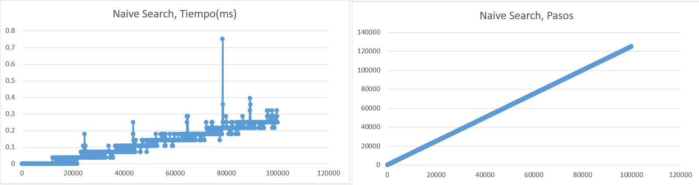
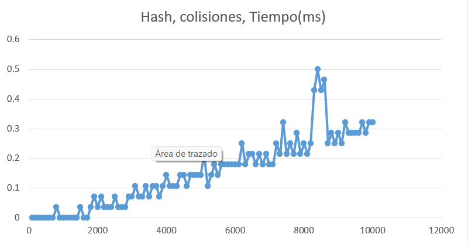

# String Matching

## 1. Descripción

El problema de **String Matching** consiste en buscar las apariciones de un patrón dentro de una cadena de texto.

En este trabajo se implementaron dos enfoques para resolver el mismo problema:

- **Naive Search**.
- **Búsqueda mediante Hash**.

Ambos algoritmos buscan el patrón `"carbon"` dentro de una cadena de texto. La diferencia principal se encuentra en la forma en que determinan si el patrón coincide con una posición del texto.

Naive Search realiza comparaciones directas entre los caracteres, mientras que el segundo enfoque convierte los caracteres a valores numéricos y utiliza una función hash para comparar el patrón con las diferentes secciones del texto.

---

## 2. Algoritmos implementados

### Naive Search

Naive Search recorre cada posible posición del texto donde puede comenzar el patrón.

Para cada posición, compara los caracteres del patrón con los caracteres correspondientes del texto:

```c
for(int i=0; i<=(n-m); i++){
    int j=0;
    for(j=0; j<m; j++){
        PASOS++;
        if(Patron[j] != Text[i+j]){
            break;
        }
    }
}
```

Si encuentra un carácter diferente, la comparación se detiene y continúa con la siguiente posición del texto.

La variable `PASOS` permite registrar el número de comparaciones realizadas durante la búsqueda.

---

### Búsqueda mediante Hash

Este enfoque convierte cada carácter a un valor numérico. Para ello, las letras mayúsculas reciben valores de 1 a 26 y las minúsculas de 27 a 52.

Posteriormente, se calcula el hash del patrón utilizando el método de Horner:

```c
hashPatron = (hashPatron * longAlfabeto + numCar) % MOD;
```

De la misma forma, se calcula el hash de la primera sección del texto que tiene la misma longitud que el patrón.

Después se utiliza una **ventana deslizante** para recorrer el resto del texto. En lugar de calcular completamente un nuevo hash para cada sección, se elimina la contribución del carácter que sale y se incorpora el nuevo carácter:

Después se recorre el resto del texto calculando el hash de cada sección de longitud **m**. Para obtener el siguiente hash, se utiliza el valor calculado anteriormente, eliminando el valor que aporta el carácter que sale y agregando el valor del nuevo carácter que entra.

```c
hashNuevo = (hashAnterior-valPosiCaracterSale+MOD)%MOD;
hashNuevo = (hashNuevo * longAlfabeto + getNum_caracter(Text[i])) % MOD;
```

Cuando el hash de una sección coincide con el hash del patrón, se utiliza `validarCadena()` para comparar directamente los caracteres.

Esto es necesario porque dos cadenas diferentes pueden producir el mismo valor hash, generando una **colisión**.

---

## 3. Análisis de complejidad

### Naive Search

El algoritmo analiza hasta **n - m + 1** posiciones posibles dentro del texto. En cada posición puede comparar hasta **m** caracteres del patrón. Por lo tanto, en el peor caso, la complejidad es:

**O((n - m + 1) * m)**  Simplificando: **O(n * m)**

---

### Búsqueda mediante Hash

Inicialmente se recorren los **m** caracteres del patrón para calcular su hash y los primeros **n** caracteres del texto para obtener el hash de la primera sección.

Después se recorren las posiciones restantes del texto actualizando el hash mediante la ventana deslizante.

Cuando no existen muchas colisiones, el comportamiento esperado es **O(n + m)**

Sin embargo, cuando dos valores hash coinciden, se ejecuta `validarCadena()`, que puede realizar hasta **m** comparaciones.

Si se producen colisiones en una gran cantidad de posiciones, el peor caso puede llegar a: **O(n * m)**

Por lo tanto:

**Caso esperado: O(n + m)**
**Peor caso:     O(n * m)**

---

## 4. Metodología experimental

Para analizar el comportamiento de los algoritmos se utilizó una cadena almacenada en un archivo y se buscó el patrón: **carbon**, este patron se introdujo 5000 veces en el texto. Y el texto se creo con una longitud de 10000 caracteres.

Para cada tamaño de entrada se realizaron: **30 experimentos**

El tiempo de ejecución se obtuvo utilizando `clock()` y se convirtió a milisegundos.

Para reducir el efecto de valores extremos, de los 30 tiempos registrados se eliminaron:

- El tiempo mayor.
- El tiempo menor.

El promedio se calculó utilizando los 28 experimentos restantes:

En **Naive Search**, los tamaños del texto aumentan desde 100 hasta 100000 caracteres en intervalos de 100.

En la implementación mediante **Hash**, los tamaños aumentan desde 100 hasta 10000 caracteres, también en intervalos de 100.

---

## 5. Graficas

### Naive Search - Tiempos y pasos de ejecución



### Hash - Tiempo de ejecución



---

## 6. Análisis de los resultados

### Naive Search

Los resultados de **Naive Search** muestran un crecimiento aproximadamente lineal tanto en el número de pasos como en el tiempo de ejecución. Esto se observa con mayor claridad en la gráfica de pasos, donde el número de comparaciones aumenta conforme aumenta el tamaño del texto.

En la gráfica de tiempo se presentan diferentes **picos**, los cuales están relacionados con las ocurrencias del patrón `"carbon"` introducidas dentro del texto. Ya que Naive Search compara directamente los caracteres del patrón en cada posible posición. 

### Búsqueda mediante Hash

El algoritmo mediante **Hash** también presenta un crecimiento aproximadamente lineal conforme aumenta el tamaño del texto.

Tambien se observa una menor cantidad de **picos** en comparación con Naive Search. Esto se debe a que el algoritmo primero compara el hash de cada sección del texto con el hash del patrón y solamente cuando estos valores coinciden se ejecuta la función `validarCadena()`.

Esta función compara directamente los caracteres para comprobar si realmente se encontró el patrón.

Por lo tanto, el uso del hash permite reducir la cantidad de comparaciones realizadas durante la búsqueda, ya que `validarCadena()` solamente se ejecuta cuando existe una colision entre los valores hash.
